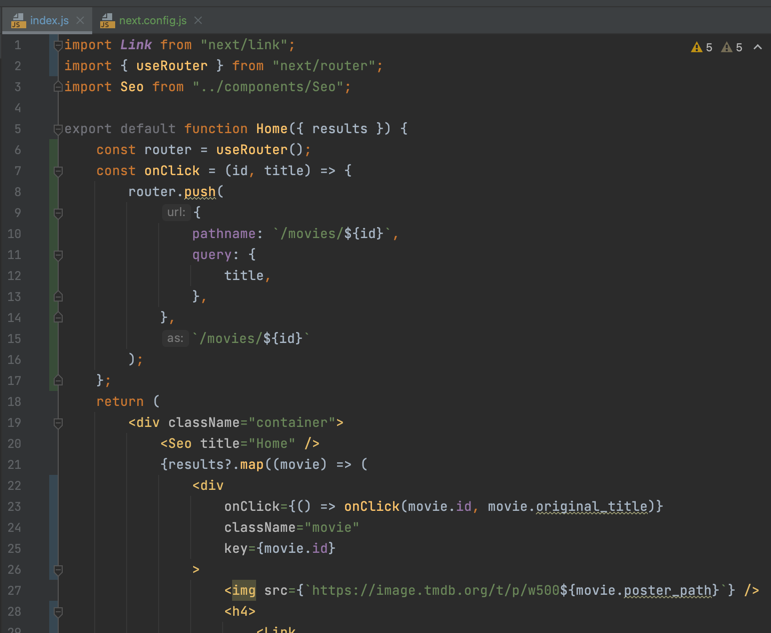

# Next JS Introduction

## 강의
https://nomadcoders.co/nextjs-fundamentals/lectures/3436

위 강의와 댓글을 참고하였습니다.

---
## 0 Introduction

## 0.1 Requirements

---

## 0.2 Creating a Project

* 프로젝트 생성

  npx create-next-app@latest
    
   

* 프로젝트 실행
  npm run dev  
   

  http://localhost:3000
   

---

# 1. Framework Overview

## 1.0 Library vs Framework


 

  * 라이브러리 
    
    개발자가 어떤 프로그램을 가져다 쓰는것 (Ex React: 렌더링할때 ReactDOM.render()를 불러와서 사용한다.)
    

  * 프레임워크
    
    개발자의 코드를 프로그램이 불러오는 것 (Ex NextJS: 정해진 규칙에 따라 코드를 작성하면 렌더링된다. )

---

    ### 라이브러리와 프레임워크의 주요 차이점

    라이브러리와 프레임워크의 주요 차이점은 "Inversion of Control"(통제의 역전)입니다.
    라이브러리에서 메서드를 호출하면 사용자가 제어할 수 있습니다.
    그러나 프레임워크에서는 제어가 역전되어 프레임워크가 사용자를 호출합니다.

* 라이브러리

    사용자가 파일 이름이나 구조 등을 정하고, 모든 결정을 내림

* 프레임워크

    파일 이름이나 구조 등을 정해진 규칙에 따라 만들고 따름
  
# 1.1 Pages

    pages 폴더 안에 있는 파일명에 따라 route가 결정된다.
    pages/about.js 생성 ->
    localhost:3000/about (O)
    localhost:3000/about-us(X)
    
    다만 예외사항으로, index.js의 경우에는
    앱이 시작하는 파일이라고 보면 된다.
    즉 localhost:3000 그 자체다 뒤에 /index 로 붙이면 안된다.
    
    이 강의를 들을 때는 import react from "react"를 쓸 필요가 없다.
    다만 useState,useEffect, lifecycle method 같은 애들을 써야 할 경우에는 꼭 import를 해줘야 한다.

# 1.2 Static Pre Rendering

    CSR(Client Side Rendering)테스트 해보시려면
    아래 사이트에서 개발자 도구 -> Network -> Slow 3G로 바꾸시고, Disable cache를 클릭해주시고 새로고침하시면 테스트해볼 수 있습니다.
    https://nomadcoders.github.io/react-masterclass/
    
    자바스크립트 비활성화하기
    보안 및 개인정보 보호-사이트 및 방패 설정-자바스크립트-자바스크립트 비활성화

* 크롬 개발자 도구에서 설정 버튼 클릭 (https://billnote.net/699)
    
    * Debugger : Disable JavaScript 체크
    
      
# 1.3 Routing


    No HTML link for pages
    
    페이지 간 클라이언트 측 경로 전환을 활성화하고 single-page app 경험을 제공하려면 Link컴포넌트가 필요합니다.
    ```
    // 변경 전
    < a href="/about">About Us< /a>
    
    // 변경 후
    import Link from 'next/link'
    
    < Link href="/about">
    < a>About Us< /a>
    < /Link>
    ```
    https://nextjs.org/docs/messages/no-html-link-for-pages
    
    useRouter()
    앱의 함수 컴포넌트에서 router객체 내부에 접근하려면 userRouter()훅을 사용할 수 있습니다.
    useRouter는 React Hook입니다. 즉, 클래스와 함께 사용할 수 없습니다. withRouter를 사용하거나 클래스를 함수 컴포넌트로 래핑할 수 있습니다.
    ```
    const router = useRouter()
    ```
    https://nextjs.org/docs/api-reference/next/router#userouter

# 1.4 CSS Modules


 

    
    Array.prototype.join()
    join() 메서드는 배열의 모든 요소를 연결해 하나의 문자열로 만듭니다.
    const elements = ['Fire', 'Air', 'Water'];
    console.log(elements.join()); // expected output: "Fire,Air,Water"
    console.log(elements.join('-')); // expected output: "Fire-Air-Water"
    https://developer.mozilla.org/ko/docs/Web/JavaScript/Reference/Global_Objects/Array/join
    
    CSS Module 사용하기
    1. className={`${styles.link} ${router.pathname === "/" ? styles.active : ""}`}
    2. [styles.link, router.pathname === "/" ? styles.active : ""].join(" ")

# 1.5 Styles JSX


    
    Built-In CSS Support (내장 CSS 지원)
    
    Next.js를 사용하면 JavaScript 파일에서 CSS 파일을 가져올 수 있습니다.
    이것은 Next.js가 import 개념을 JavaScript 이상으로 확장하기 때문에 가능합니다.
    
    CSS-in-JS
    격리된 범위 CSS에 대한 지원을 제공하기 위해 styled-jsx를 번들로 제공합니다. 목표는 불행히도 서버 렌더링을 지원하지 않고 JS 전용인 Web Components와 유사한 "Shadow CSS"를 지원하는 것입니다.
    https://nextjs.org/docs/basic-features/built-in-css-support#css-in-js
    
    styled-jsx를 사용하는 컴포넌트는 다음과 같습니다.
    ```
    < style jsx>{`
    CSS 스타일..
    `}< /style>
    ```
    styled-jsx
    https://github.com/vercel/styled-jsx
    
    Adding Component-Level CSS
    Next.js는[name].module.css 파일 명명 규칙을 사용하여 CSS Module을 지원합니다.
    
    Sass Support
    Next.js를 사용하면.scss 및.sass 확장자를 모두 사용하여 Sass를 가져올 수 있습니다.

# 1.6 Custom App


    
* _app.js

    

* NavBar.js
  


* about.js


* index.js


    Next.js는 App 컴포넌트를 사용하여 page를 초기화합니다. 이를 재정의하고 페이지 초기화를 제어할 수 있습니다. 이를 통해 다음과 같은 놀라운 일을 할 수 있습니다.
    
    1. 페이지 변경 간에 레이아웃 유지
    2. 페이지 탐색 시 state 유지
    3. componentDidCatch를 사용한 Custom 에러 처리
    4. 페이지에 추가 데이터 삽입
    5. Global CSS 추가
    
    기본 App을 재정의하려면 아래와 같이 ./pages/_app.js 파일을 만듭니다.
    ```
    export default function MyApp({ Component, pageProps }) {
    return < Component {...pageProps} />
    }
    ```
    https://nextjs.org/docs/advanced-features/custom-app
    
    Custom App (with 타입스크립트)
    _app.ts가 아닌 _app.tsx파일을 만들고 아래와 같이 작성
    ```
    import type { AppProps } from 'next/app'
    
    export default function MyApp({ Component, pageProps }: AppProps){
    return < Component {...pageProps} />
    }
    ```
    https://nextjs.org/docs/basic-features/typescript#custom-app
    
    + 파일명.module.css 파일 형태를 제외한 모든 나머지 css파일들은 _app.js에서만 import해와서 사용해야 한다. (글로벌 css간의 충돌을 피하기 위해서이다.)
      https://nextjs.org/docs/messages/css-global

---

# 2 Practice Project

# 2.0 Patterns


# 2.1 Fetching Data


* API 호출

    

#2.2 Redirect and Rewrite (13:31)

## Redirect

* localhost:3000/contact 로 접속하면 form으로 리다이렉트 처리
  ( next.config.js 수정 후 재시작해야 함 npm run dev )


* localhost:3000/old-blog/1515 로 접속하면  http://localhost:3000/new-sexy-blog/1515 리다이렉트 처리

  

  
    redirects = source의 URL을 destination으로 바꿔서 연결해줌
    rewrites = 실제 URL은 destination 이지만 source라고 구라침


## Rewrite


#2.3 Server Side Rendering (11:24)


    getServerSideProps
    page에서 서버 측 랜더링 함수인 getServerSideProps함수를 export하는 경우 Next.js는 getServerSideProps에서 반환된 데이터를 사용하여 각 request에서 이 페이지를 pre-render합니다. getServerSideProps는 서버 측에서만 실행되며 브라우저에서는 실행되지 않습니다.
    https://nextjs.org/docs/basic-features/data-fetching/get-server-side-props
    
    getServerSideProps를 사용하여 request시 데이터 fetch하기
    다음 예는 request 시 데이터를 fetch하고 결과를 pre-render하는 방법을 보여줍니다.
    (fetch할 때 오류 뜨시는 분들은 https를 http로 바꿔주시면 됩니다.)
    ```
    export default function Home({ data }) {
    // 데이터 랜더링
    }
    
    // 매 request마다 실행됩니다.
    export async function getServerSideProps() {
    const res = await fetch(`https://.../data`);
    const data = await res.json();
    
    // props를 통해 page에 data전달
    return { props: { data } }
    }
    ```
    https://nextjs.org/docs/basic-features/data-fetching/get-server-side-props#using-getserversideprops-to-fetch-data-at-request-time
    
    getServerSideProps (타입스크립트와 함께 사용하기)
    https://nextjs.org/docs/api-reference/data-fetching/get-server-side-props#getserversideprops-with-typescript

#2.4 Recap (05:16)


  ## React JS 는 useEffect, useState, fetch 후 state에 넣어서 화면에 표시
    
    getServerSideProps 추가 설명
    https://nextjs.org/docs/basic-features/data-fetching/get-server-side-props
    
    언제 getServerSideProps를 사용해야 하나요?
    request time에 반드시 데이터를 fetch해와야 하는 페이지를 pre-render해야 하는 경우에만 getServerSideProps를 사용해야 합니다.
    데이터를 pre-render할 필요가 없다면 client side에서 데이터를 가져오는 것을 고려해야 합니다.
    
    클라이언트 측에서 데이터 가져오는 과정 (Fetching data on the client side)
    페이지에 자주 업데이트되는 데이터가 포함되어 있고 데이터를 pre-render할 필요가 없는 경우 클라이언트 측에서 데이터를 가져올 수 있습니다.
    1. 먼저 데이터가 없는 페이지를 즉시 표시합니다.
    2. 페이지의 일부는 Static Generation을 사용해 pre-render할 수 있습니다.
    3. 없는 데이터를 위해 loading 상태를 표시할 수 있습니다.
    4. 그런 다음 클라이언트 측에서 데이터를 가져와 준비가 되면 표시합니다.
    
    이 접근 방식은 예를 들어 사용자 대시보드 페이지에 적합합니다.
    왜냐하면 대시보드는 사용자별 비공개 페이지이기 때문에 SEO와는 관련이 없으며 페이지를 미리 렌더링할 필요가 없습니다. 또한 데이터는 자주 업데이트되므로 요청 시 데이터를 가져와야 합니다.
    
    getServerSideProps가 오류 페이지를 렌더링합니까?
    getServerSideProps 내부에서 오류가 발생하면 pages/500.js 파일이 표시됩니다.
    500 page(서버 렌더링 오류 페이지)는 사용자가 커스터 마이징 할 수 있습니다.
    개발 중에는 이 파일이 사용되지 않고 대신 개발 오버레이가 표시됩니다.

#2.5 Dynamic Routes (07:02)

  


    

    Dynamic Routes
    Next.js에서는 page에 대괄호([param])를 추가하여 Dynamic Route를 생성할 수 있습니다.
    /movies/1, /movies/abc 등과 같은 모든 경로는 pages/movies/[id].js와 일치합니다.
    ```
    const router = useRouter()
    const { id } = router.query
    ```
    https://nextjs.org/docs/routing/dynamic-routes
    
    Catch all routes
    대괄호 안에 세 개의 점(...)을 추가하여 모든 경로를 포착하도록 Dynamic Routes를 확장할 수 있습니다. pages/movies/[...id].js는 /movies/1와 일치하지만 /movies/1/2, /movies/1/ab/cd 등과도 일치합니다. 일치하는 매개변수는 페이지에 쿼리 매개변수로 전송되며 항상 배열이므로 /movies/a 경로에는 다음 쿼리 개체가 있습니다.
    ex) { "id": ["a"] }
    https://nextjs.org/docs/routing/dynamic-routes#catch-all-routes

#2.6 Movie Detail (13:32)





### API 호출 ( http://localhost:3000/api/movies/453395)


    
    router.push(url, as, options)
    
    클라이언트 측 전환을 처리합니다. 이 방법은 next/link가 충분하지 않은 경우에 유용합니다.
    url: UrlObject | String: 탐색할 URL
    as: UrlObject | String: 브라우저 URL 표시줄에 표시될 경로에 대한 선택적 데코레이터입니다.
    ```
    router.push({
    pathname: '/post/[pid]',
    query: { pid: post.id },
    })
    ```
    + 외부 URL에 대해서는 router.push()를 사용할 필요가 없습니다.
      window.location을 사용하는 것이 더 적합합니다.
      https://nextjs.org/docs/api-reference/next/router#routerpush
    
    Movie Detail API
    API: https://api.themoviedb.org/3/movie/{movie_id}?api_key=api_key&language=en-US
    https://developers.themoviedb.org/3/movies/get-movie-details

#2.7 Catch All (10:21)


    
    getServerSideProps
    페이지에서 getServerSideProps(서버 측 렌더링)라는 함수를 export하는 경우 Next.js는 getServerSideProps에서 반환된 데이터를 사용하여 각 request에서 이 페이지를 pre-render합니다.
    https://nextjs.org/docs/basic-features/data-fetching/get-server-side-props
    
    getServerSideProps (Context parameter)
    params: 이 페이지에서 dynamic route(동적 경로)를 사용하는 경우 params에 route parameter가 포함됩니다. 페이지 이름이 [id].js이면 params는 { id: ... }처럼 보일 것입니다.
    query: 쿼리 문자열을 나타내는 객체입니다.
    https://nextjs.org/docs/api-reference/data-fetching/get-server-side-props#context-parameter
    
    getServerSideProps (타입스크립트와 함께 사용하기)
    ```
    import { GetServerSideProps } from 'next'
    
    export const getServerSideProps: GetServerSideProps = async (context) => {
    // ...
    }
    
    function Page({ data }: InferGetServerSidePropsType< typeof getServerSideProps>)
    ```
    https://nextjs.org/docs/api-reference/data-fetching/get-server-side-props#getserversideprops-with-typescript
    
    router.query.params 타입 지정 (타입스크립트)
    ```
    type MovieDetailParams = [string, string] | [];
    
    const router: NextRouter = useRouter();
    const [title, id] = (router.query.params || []) as MovieDetailParams;
  
  ---
  

    혹시나 저처럼 왜 || [] 를 추가해주면 되는건지 궁금하신분들을 위해 남겨봅니다.
    기본적으로 미리 렌더링이 되기때문에 먼저 html 파일이 내려온다는건 다들 아실겁니다. 이때 문제가 아직 js들이 다운로드가 안됐기 때문에 useRouter()로 정보를 제대로 가져오질 못하는 상태입니다. 그렇기 때문에 초기에는 빈 배열을 추가해줘서 오류가 발생하지 않도록 해주고, js가 내려가서 다시 렌더링하게되면 그 때는 빈 배열이 아닌 router.query.params에서 값을 가져와서 뿌려주는거죠.
    정확하게 보고싶으신 분들은 검사 -> 네트워크 -> slow 3g 로 설정하신 후에 페이지 렌더링 확인하시면 먼저 html쪽 뜨고나서 js까지 모두 다운로드 된 후에야 title이 보이는걸 볼 수 있으실거예요.
    추가로 위와 같은 이유로 console.log(router)를 찍으면 2번 보이는겁니다.
    SSR 방식이기 때문인데
    https://ayaan.oopy.io/ssr-vs-csr를 참고하시면 좋을 것 같습니다 :)

#2.8 404 Pages (02:06)