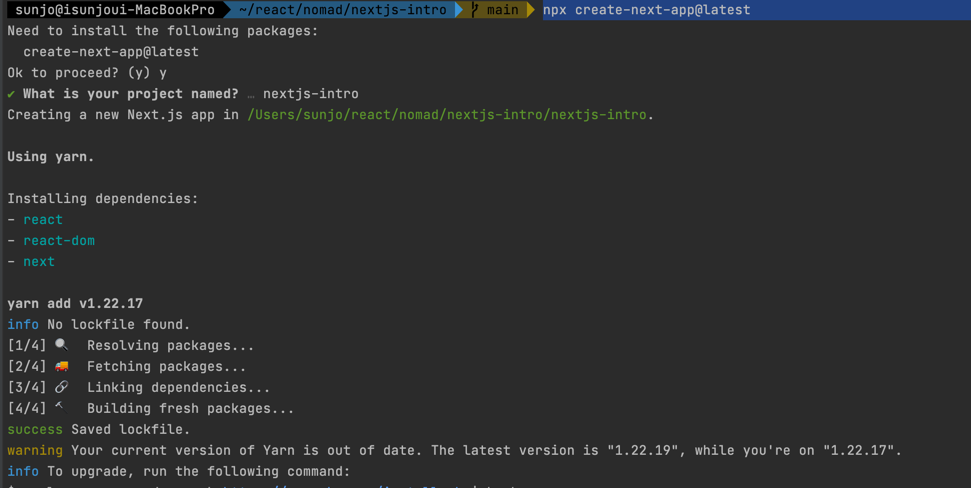
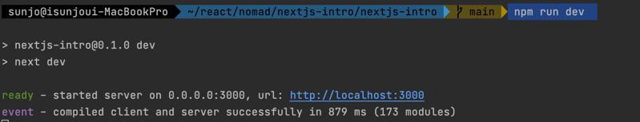
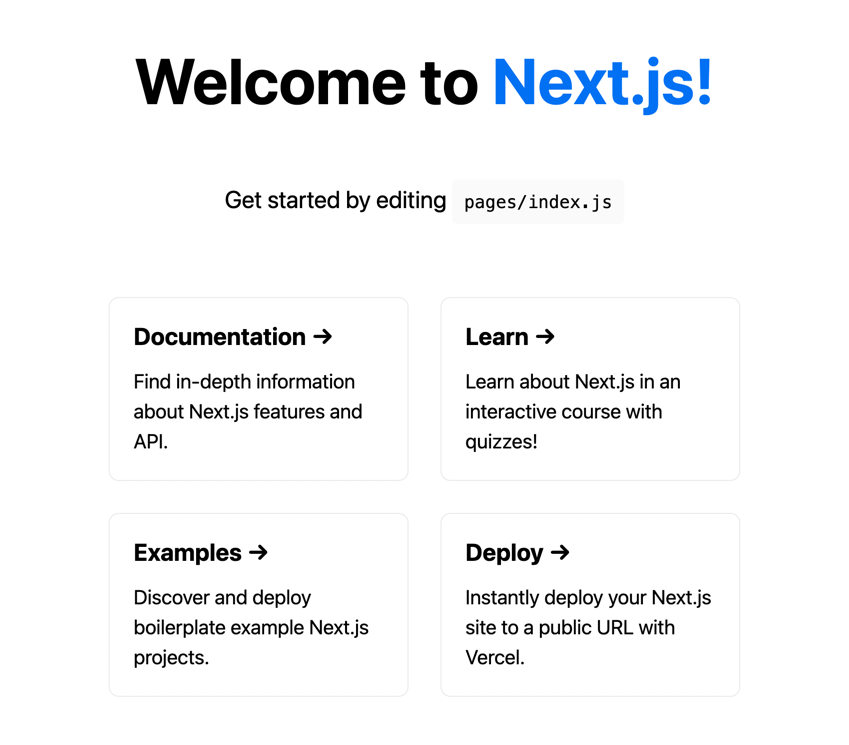

 # Next JS Introduction
 
## 강의
https://nomadcoders.co/nextjs-fundamentals/lectures/3436

---
## 0 Introduction

## 0.1 Requirements

---

## 0.2 Creating a Project

* 프로젝트 생성 
 
    npx create-next-app@latest

    

* 프로젝트 실행
    npm run dev  
    

    http://localhost:3000
    

---
 

